# YouTubeX


## 📝 Table of Contents

- [About](#about)
- [features](#features)
- [Technologies used](#build)
- [getting started](#start)
- [Demo](#demo)
- [screenshots](#screenshots)

### 🚩About<a name = "about"></a>

  YouTubeX is a clone of YouTube. It is a simple, yet powerful, application that allows you to watch videos and share them with your friends. It is built using the [React](https://reactjs.org/) framework.

it`s a full mimic of YouTube with most of its features. 


### ✨ Features <a name = "features"></a>

- Authenticate users using json web tokens
- upload videos & thumbnails to cloud storage
- like / dislike videos
- save videos to watch later
- subscribe to channels && view their videos
- search for video
- Show trending videos based on the most viewed videos
- history of videos watched by the user
- add comments to videos && could delete them
- light theme && dark theme

## 💻Technologies Used<a name = "build"></a>

#### Frontend

- React
- Redux Toolkit
- Redux Persist
- styled-components
- Axios

#### backend

- Node.js
- Express
- MongoDB
- jsonwebtoken `for authentication`
- bcrypt `for hashing passwords`

## 🏁Getting Started <a name = "start"></a>

```
git clone https://github.com/omar214/YouTube-Clone.git
```

```
cd YouTubeX
```

to run frontend

```
cd Client
npm install

npm start
```

to run backend

```
cd Server
npm install
npm start

```

## 🎥 Demo<a name = "demo"></a>

<div name = "demo" align="center" width=1189>

<!--  -->

https://user-images.githubusercontent.com/60351557/172169848-192f95a5-a64d-481b-a82b-e647cfd268e0.mp4

</div>

## 🎥 screenshots<a name = "screenshots"></a>

- Sign up
  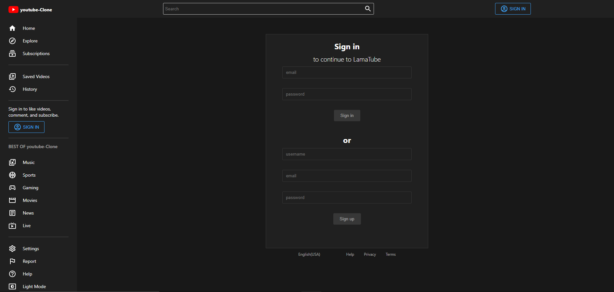
- Home page
  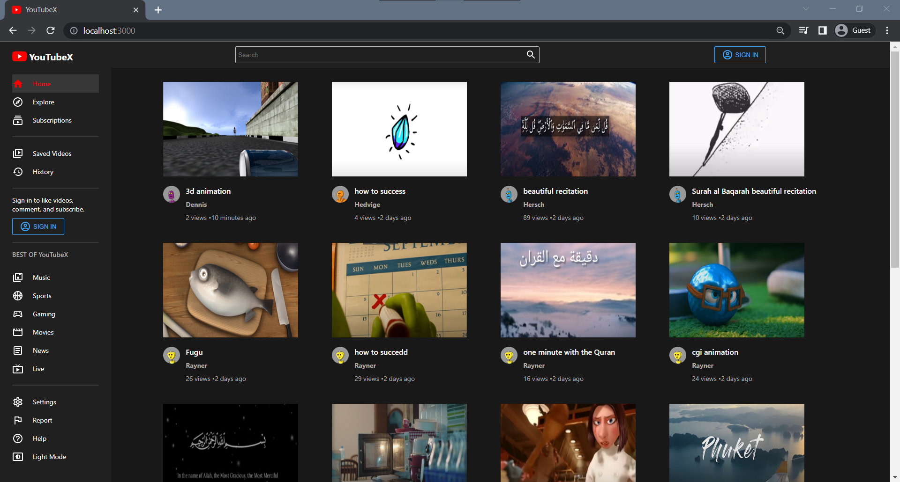
- Light Theme
  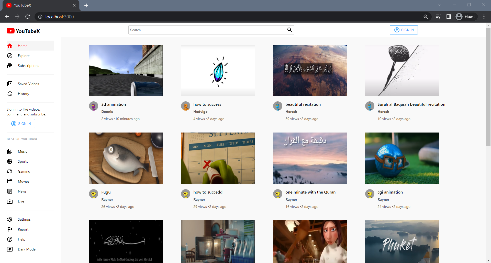
  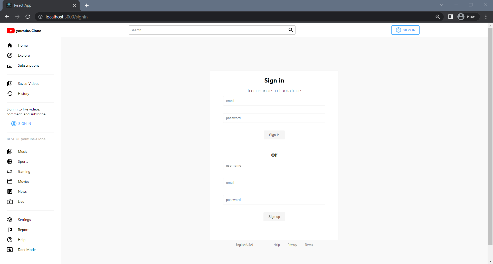
- Video Page
  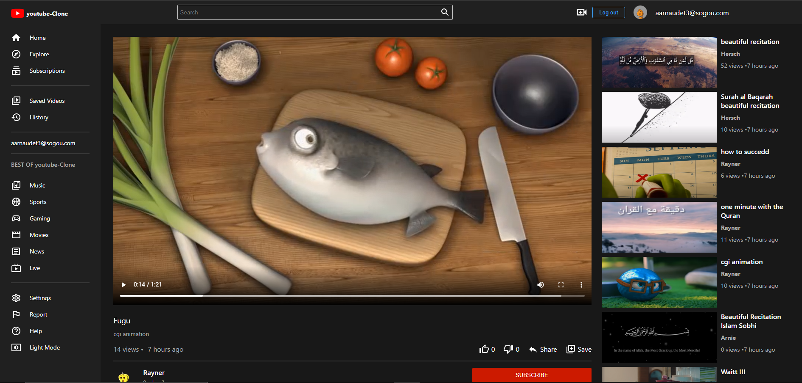
- Comments
  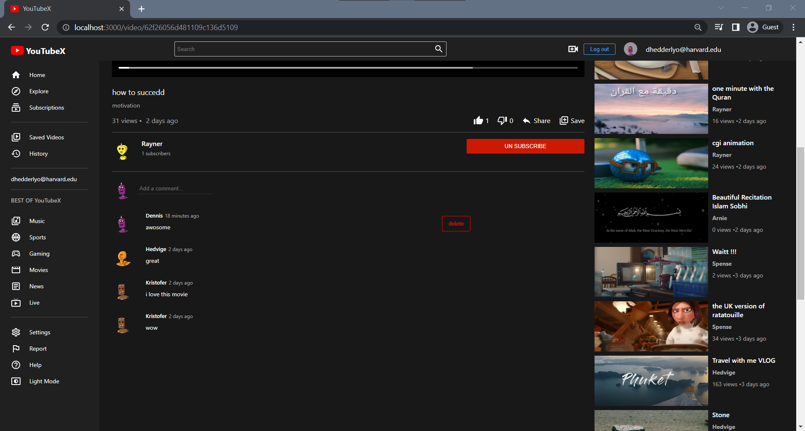
- upload video
  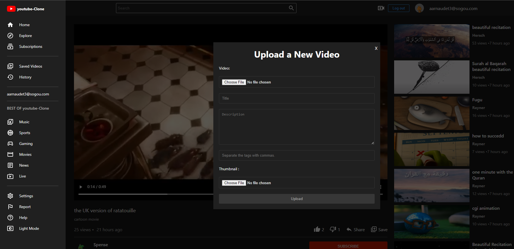
- Responsive Design
  - sign up
    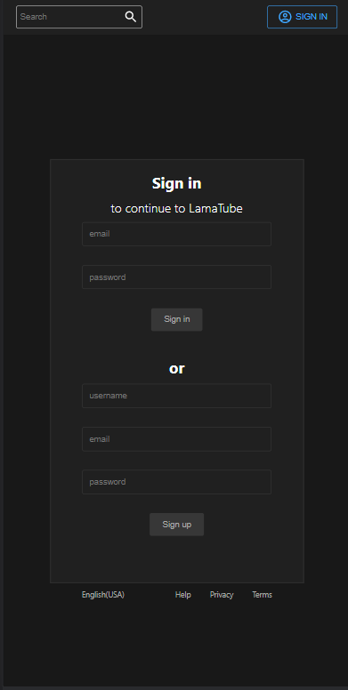
  - home page
    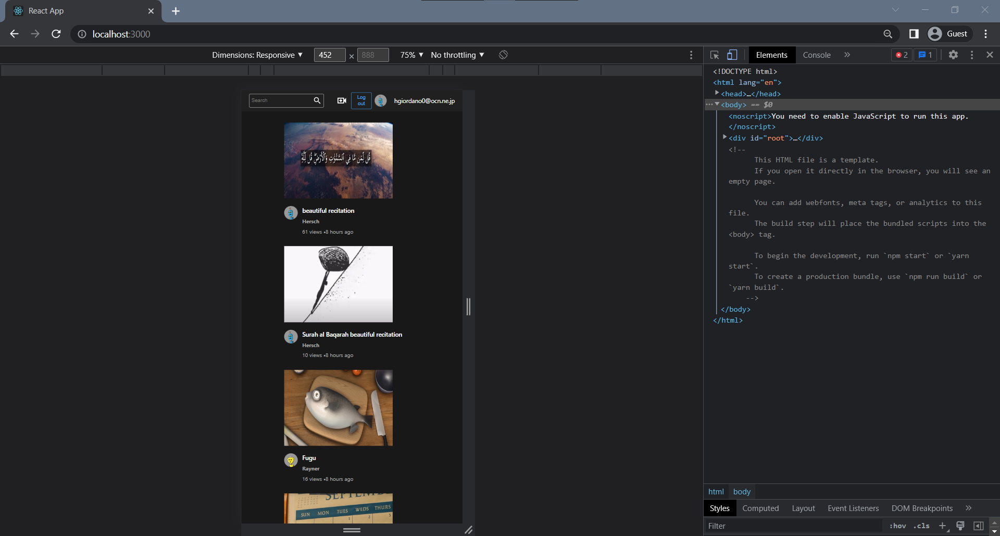
  - video page
    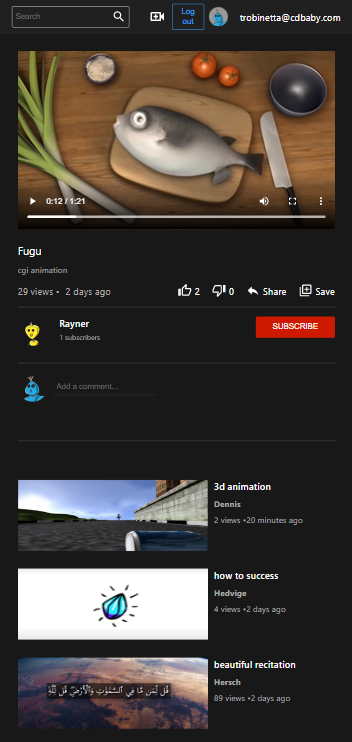
  - home page
    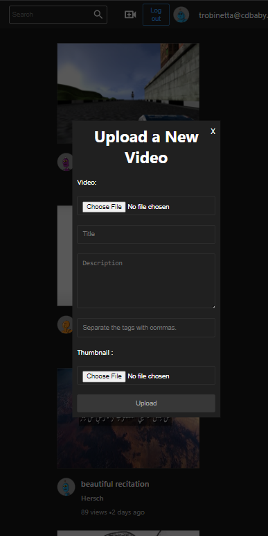
  - history page
    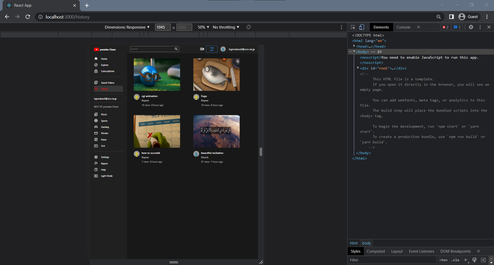

```

```
