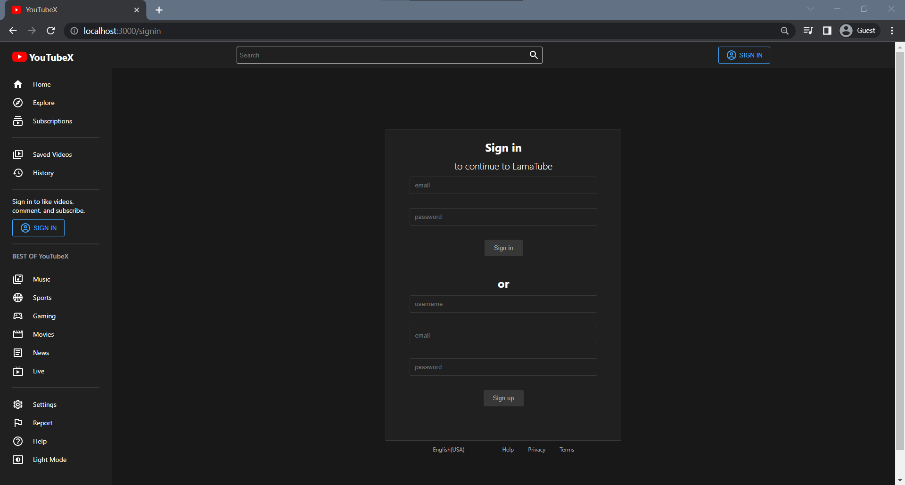
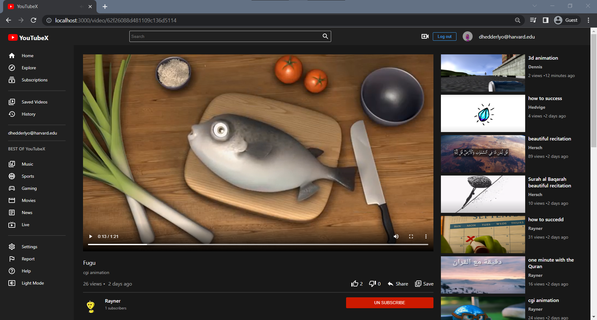
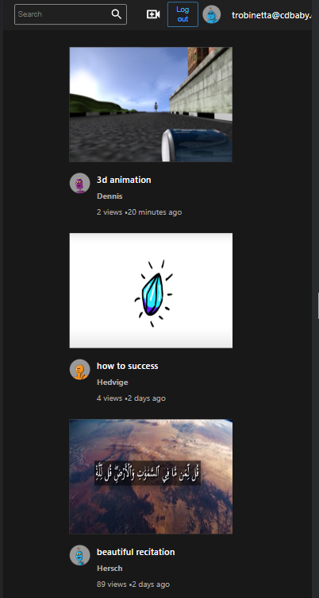
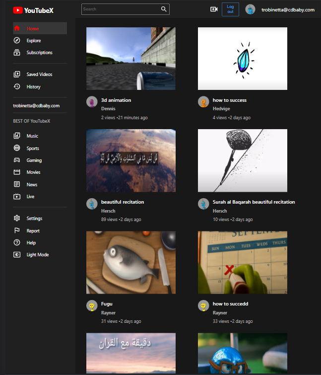

# YouTubeX  

## 📝 Table of Contents

- [About](#about)
- [features](#features)
- [Technologies used](#build)
- [getting started](#start)
- [Demo](#demo)
- [screenshots](#screenshots)

### 🚩About<a name = "about"></a>

YouTubeX is a clone of YouTube. It is a simple, yet powerful, application that allows you to watch videos and share them with your friends. It is built using the [React](https://reactjs.org/) framework.

it`s a full mimic of YouTube with most of its features.

### ✨ Features <a name = "features"></a>

- Authenticate users using json web tokens
- upload videos & thumbnails to cloud storage
- like / dislike videos
- save videos to watch later
- subscribe to channels && view their videos
- search for video
- Show trending videos based on the most viewed videos
- history of videos watched by the user
- add comments to videos && could delete them
- light theme && dark theme

## 💻Technologies Used<a name = "build"></a>

#### Frontend

- React
- React-Router dom
- Redux Toolkit
- Redux Persist
- styled-components
- Axios

#### backend

- Node.js
- Express
- MongoDB
- jsonwebtoken `for authentication`
- bcrypt `for hashing passwords`

## 🏁Getting Started <a name = "start"></a>

1. **_Clone the repository_**

```bash
git clone https://github.com/omar214/YouTubeX.git
```

2. **_Go to the directory of the repository_**

```bash
cd YouTubeX
```

3. **_to run frontend_**

```bash
cd Client
npm install

npm start
```

4.**_to run backend_**

```bash
cd Server
npm install
npm start

```

## 🎥 Demo<a name = "demo"></a>

<div name = "demo" align="center" width=1189>

<!--  -->


**Home page & Sign in & Themes**

https://user-images.githubusercontent.com/60351557/184158149-7402dd75-f7b5-4d95-a355-8f5ebdf2b0e0.mp4


**Video page & comments** `enable video sound to hear the video`


https://user-images.githubusercontent.com/60351557/184158296-466f230b-b596-496a-989e-2385c3795534.mp4


**Saved videos & subscription & history**


https://user-images.githubusercontent.com/60351557/184158448-28d3a6f1-a7ba-40ed-98d4-cf341b5d3cbf.mp4


**Search**


https://user-images.githubusercontent.com/60351557/184158546-1b5c8e29-08e0-4454-a1c4-d7730f327a90.mp4


**uploading video & thumbnails**


https://user-images.githubusercontent.com/60351557/184158598-9c6b326f-ce85-41bb-9837-0510e1ba4b74.mp4


</div>

## 🎥 screenshots<a name = "screenshots"></a>

- Sign up
  
  <hr />
- Home page
  

  <hr />

- Light Theme
  
  

  <hr />

- Video Page
  

  <hr />

- Comments
  

  <hr />

- upload video
  

  <hr />

- Responsive Design
  - sign up
 
    

  <hr />
  
  - home page
 
  

  <hr />
 
 - video page
 
 

  <hr />
  
  - Upload page
  
  

  <hr />
  
  - tablet View
  
  
